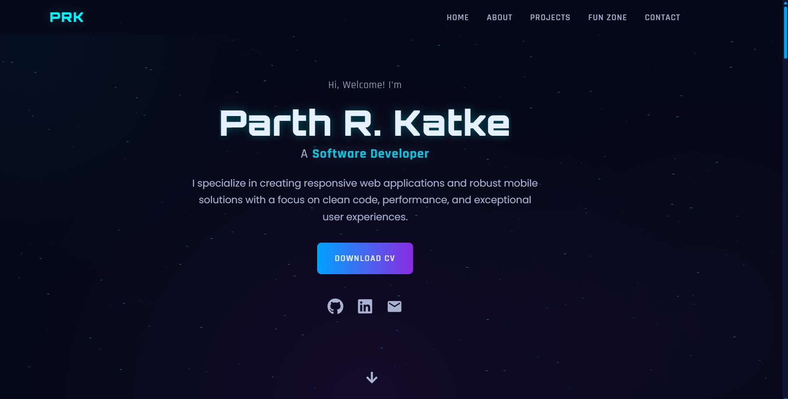

# Parth R. Katke - Portfolio Website



## Description
This is a personal portfolio website built with React.js to showcase my skills, projects, and professional experience. The website features a modern, responsive design with smooth animations and transitions powered by Framer Motion.

## Features
- Animated page transitions with custom overlay loading screen
- Responsive design that works on all device sizes
- Interactive UI elements with hover animations
- Project showcase with filterable categories
- Contact form with validation
- Downloadable resume/CV
- Social media integration

## Technologies Used
- React.js
- Framer Motion for animations
- CSS3 with custom properties
- React Icons
- React Router (for navigation)
- GitHub Pages (for hosting)

## Prerequisites
- Node.js (v14.0.0 or later)
- npm (v6.0.0 or later)

## Installation
1. Clone the repository:
   ```bash
   git clone https://github.com/Parth-RK/Parth-RK.github.io.git
   cd Parth-RK.github.io
   ```

2. Install dependencies:
   ```bash
   npm install
   ```

3. Environment Variables
   create a .env file and add the following to it
   ```
   REACT_APP_CONTACT_FORM_API='<Google-Appscript-Web-App-URL>'
   ```
   AppsScript URL is to collect the contact form responses to a google sheet or send directly to your inbox.
   This script saves the form messages and send you an email notification as well.
   code.gs
   ```
   function doPost(e) {
      try {
         var sheet = SpreadsheetApp.getActiveSpreadsheet().getSheetByName("FormResponses");
         var data = JSON.parse(e.postData.contents);

         // Basic validation to prevent errors
         if (!data.name || !data.email || !data.message) {
            throw new Error("Missing required form fields.");
         }
         
         sheet.appendRow([
            new Date(),
            data.name,
            data.email,
            data.message
         ]);

         MailApp.sendEmail({
            to: "<username>@<email>.com",
            subject: `New Message from ${data.name}`,
            htmlBody: `
            <p><strong>Name:</strong> ${data.name}</p>
            <p><strong>Email:</strong> ${data.email}</p>
            <p><strong>Message:</strong></p>
            <p>${data.message.replace(/\n/g, '<br>')}</p> <!-- Sanitize message for HTML -->
            <hr><p style="font-size:12px;color:#888;">via Portfolio Site</p>
            `
         });

         // THIS IS THE CORRECTED RETURN STATEMENT
         return ContentService
            .createTextOutput(JSON.stringify({ result: 'success', message: 'Data received successfully.' }))
            .setMimeType(ContentService.MimeType.JSON);

      } catch (error) {
         // Return a JSON error response if something goes wrong
         return ContentService
            .createTextOutput(JSON.stringify({ result: 'error', message: error.toString() }))
            .setMimeType(ContentService.MimeType.JSON);
      }
   }
   ```

## Usage

### Development Server
Start the development server:
```bash
npm start
```
This will launch the website on [http://localhost:3000](http://localhost:3000).

### Testing
Run the test suite:
```bash
npm test
```

### Building for Production
Create an optimized production build:
```bash
npm run build
```

## Folder Structure
```
src/
├── components/     # React components
├── styles/         # CSS stylesheets
├── assets/         # Images, videos, and other static files
├── App.js          # Main application component
└── index.js        # Application entry point
```

## Customization
To customize this portfolio for your own use:

1. Update personal information in the components
2. Replace projects in the Projects component with your own work
3. Change color schemes by modifying CSS variables in variables.css
4. Update the resume file in the public folder

## Deploying to GitHub Pages

### Method 1: Using gh-pages package (Recommended)

1. Install the gh-pages package:
   ```bash
   npm install --save-dev gh-pages
   ```

2. Add these properties to your package.json:
   ```json
   "homepage": "https://yourusername.github.io",
   "scripts": {
     // other scripts
     "predeploy": "npm run build",
     "deploy": "gh-pages -d build"
   }
   ```
   (Replace 'yourusername' with your GitHub username)

3. Deploy the application:
   ```bash
   npm run deploy
   ```

### Method 2: Manual deployment

1. Build the project:
   ```bash
   npm run build
   ```

2. If this is the first deployment, create a gh-pages branch:
   ```bash
   git checkout -b gh-pages
   ```

3. Remove everything except the build folder:
   ```bash
   git rm -rf .
   git add build
   git commit -m "Deploy to GitHub Pages"
   ```

4. Push the build folder to the gh-pages branch:
   ```bash
   git subtree push --prefix build origin gh-pages
   ```

### After Deployment
- Your website will be available at: https://yourusername.github.io
- It may take a few minutes for the changes to propagate

## License
This project is licensed under the GNU General Public License v3.0 - see the LICENSE file for details.

## Contact
Feel free to reach out if you have questions or would like to connect:
- GitHub: [Parth-RK](https://github.com/Parth-RK)
- LinkedIn: [parth-rk](https://www.linkedin.com/in/parth-rk)